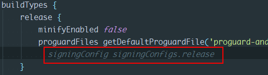
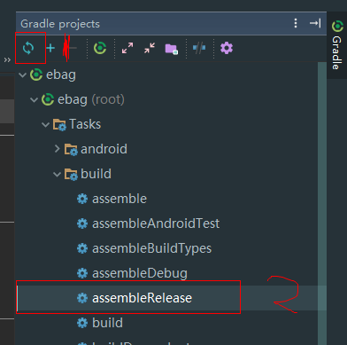
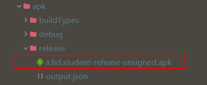
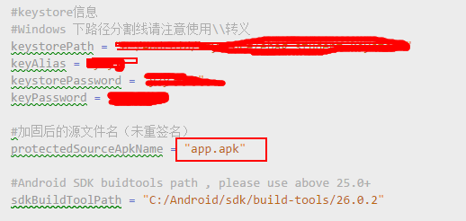
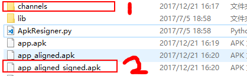

# eBag

Android客户端，ebag

## Android多渠道打包

> 这是一种多渠道的打包方式，现阶段项目并没有使用多渠道打包的方式，这里有备无患。   
> 多渠道打包的原理参见[APK Signature Scheme v2签名方案--美团多渠道打包原理](https://tech.meituan.com/android-apk-v2-signature-scheme.html)。    
> 本文用的打包方案来自[Python脚本多渠道打包工具](https://github.com/Jay-Goo/ProtectedApkResignerForWalle)。具体说明，请自行阅读。    
> 这种多渠道打包方式利用了Python脚本，所以打包时时要求系统已经安装好了Python环境，这里对Python环境的搭建不再赘述。获取渠道号的方法为
> ```Java
> PatchUtils.getChannel(this);
> ```
> 在代码里动态设置相关的渠道号就可以了

### 生成未签名的生产包

1. 打包前先将build.gradle下面的这一行注释掉，如图所示

    

2. 在步骤1之后，点击项目右上角`Gradle`图标，然后按图2所示，顺序执行1、2两个步骤，执行完毕后会生成一个未签名的生产包，如下图所示。

    

    

### 多渠道打包

1. 下载[Python脚本多渠道打包](https://github.com/Jay-Goo/ProtectedApkResignerForWalle)中的脚本文件。

2. 按说明更改`config.py`文件中的配置

    

3. 将生成的生成未签名的生产包拷贝到上述脚本的根目录，并改名为`config.py`中红色框框中的名字，运行CMD命令行工具，执行cd 命令，进入脚本文件所在的根目录，执行

    ```Java
    python ApkResigner.py
    ```
    生成下图所示的几个文件

    

    - 1中放的是渠道包，将对应的渠道包上传对应的市场就行，渠道配置文件见`channel`文件。

    - 2的文件用于做增量更新，增量更新的差分包用新旧版本打包后产生的2文件生成，这个需要服务器支持